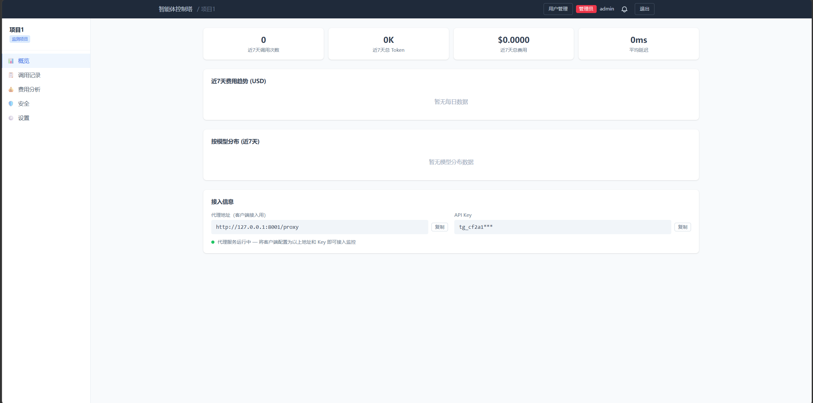
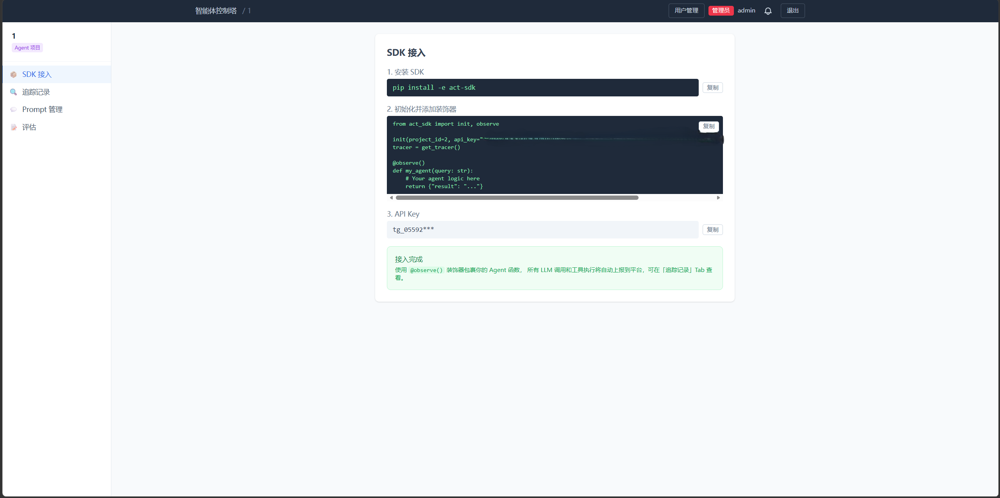

# Agent Control Tower

[](https://github.com/pramke/agent-control-tower/actions/workflows/ci.yml)

LLM observability platform — two modes, zero friction.

| Mode | How | Use case |
|------|-----|----------|
| **Mode 1: Proxy** | Point LLM client at `/proxy` | Monitor without code changes |
| **Mode 2: SDK** | `@observe()` decorator | Full trace visibility from your agent code |

## Demo





## Architecture

```
agent-control-tower/
├── backend/
│   ├── main.py                    # App entry point
│   ├── config.py                  # pydantic-settings
│   ├── healthcheck.py             # Health/live endpoints
│   ├── core/
│   │   ├── database.py            # SQLAlchemy async + SQLite
│   │   ├── security.py            # JWT (30min access + 7d refresh) + RBAC
│   │   ├── llm_utils.py           # Shared ChatOpenAI factory
│   │   └── rate_limit.py          # slowapi rate limiter
│   ├── shared/
│   │   ├── schemas.py             # Shared pydantic models
│   │   └── errors.py              # Error helpers
│   ├── migrations/                # Alembic migrations
│   ├── modules/
│   │   ├── auth/                  # Register / Login / Refresh
│   │   ├── models/                # ORM: User, Project, ApiCall
│   │   ├── proxy/                 # LLM reverse proxy (model remap, security, recording)
│   │   ├── detector/              # Prompt injection detection engine
│   │   ├── observability/         # Trace ingest, query, alerts, prompt management, pruner
│   │   ├── evaluation/            # Eval sets, LLM judge scoring, regression detection
│   │   ├── security/              # Guardrails, PII sanitizer, content filter
│   │   └── api_routes/            # Projects, stats, calls, detection
│   └── pricing/                   # Token pricing tables
├── frontend/                      # React 18 + TypeScript + TailwindCSS + Vite
│   └── src/
│       ├── pages/                 # Dashboard, Calls, Stats, TraceViewer, EvalSetManagement, ...
│       ├── components/            # Sidebar, Skeleton, EmptyState, ErrorBoundary, CopyButton
│       └── api/                   # JWT-authenticated API client
├── act-sdk/                       # Python SDK for Mode 2 (@observe decorator)
├── tests/                         # pytest (50 tests)
├── docker-compose.yml
└── start.py                       # Dev server launcher
```

## Quick Start

```bash
# 1. Set environment
$env:DATABASE_URL="sqlite+aiosqlite:///./act2.db"
$env:SECRET_KEY="$(python -c 'import secrets; print(secrets.token_hex(32))')"

# 2. Backend
pip install -r requirements.txt
python start.py                    # http://localhost:8001

# 3. Frontend (separate terminal)
cd frontend
npm install
npm run dev                        # http://localhost:3000
```

First registered user gets `admin` role. Subsequent users default to `user`.

Swagger: http://localhost:8001/docs

## Two Modes

### Mode 1 — Proxy Monitoring

Point your LLM client's base URL to `http://localhost:8001/proxy` with your project's API key. All requests are automatically logged, monitored, and scanned for security issues. Zero code changes.

### Mode 2 — SDK Tracing

```python
from act_sdk import init, observe

init(project_id=1, api_key="tg_xxx", base_url="http://localhost:8001")

@observe()
def my_agent(query: str):
    # Your agent logic — all LLM calls auto-traced
    return {"result": "..."}
```

Traces appear in the TraceViewer with full span hierarchy.

## Key Features

| Feature | Description |
|---------|-------------|
| **Multi-Provider Proxy** | Anthropic + OpenAI compatible upstreams (DeepSeek, GLM, Kimi, etc.) with per-project model selection |
| **SDK Tracing** | `@observe()` decorator captures full trace hierarchy with token/cost per span |
| **Trace Waterfall** | Tree view of nested spans with timing, tokens, cost, and status |
| **Prompt Management** | Versioned prompts with `get_prompt()` SDK integration |
| **Evaluation** | Eval sets with LLM judge scoring, regression detection |
| **Security Detection** | Prompt injection, PII sanitization, content filtering, bait credential detection |
| **Alerting** | WebSocket alerts for error rate spikes and anomalies |
| **RBAC** | admin / user roles — admin manages users, all users manage projects |
| **Structured Logging** | JSON logs with trace_id correlation |

## API Reference

### Auth
- `POST /api/auth/register` — Register (first user → admin)
- `POST /api/auth/login` — Get JWT tokens
- `POST /api/auth/refresh` — Refresh token

### Projects
- `GET /api/projects` — List all projects
- `POST /api/projects` — Create (all users)
- `GET /api/projects/{id}/full` — Detail with API key
- `PUT /api/projects/{id}/settings` — Update target model + provider type
- `DELETE /api/projects/{id}` — Delete with cascade (all users)

### Admin (users)
- `GET /api/admin/users` — List all users (admin only)
- `PUT /api/admin/users/{id}/role` — Change role (admin only)
- `DELETE /api/admin/users/{id}` — Delete user (admin only)

### Proxy
- `POST /proxy/{path}` — Forward LLM requests (authenticated by API key)

### Observability
- `GET /api/traces` — List traces with pagination
- `GET /api/traces/{id}` — Trace detail with span tree
- `POST /api/traces/ingest` — SDK trace ingest
- `GET /api/logs` — Agent logs
- `GET /api/prompts` — List prompt versions
- `WebSocket /ws/alerts` — Real-time alert stream

### Evaluation
- `GET /api/eval/sets` — List eval sets
- `POST /api/eval/sets` — Create (admin/manager)
- `POST /api/eval/runs` — Run evaluation

### Stats
- `GET /api/stats/{project_id}/summary` — Aggregated metrics
- `GET /api/stats/{project_id}/daily` — Daily breakdown
- `GET /api/stats/{project_id}/by_model` — Per-model stats

### Health
- `GET /health/live` — Liveness probe

## Testing

```bash
pytest tests/ -v          # 50 tests
```

## License

MIT
